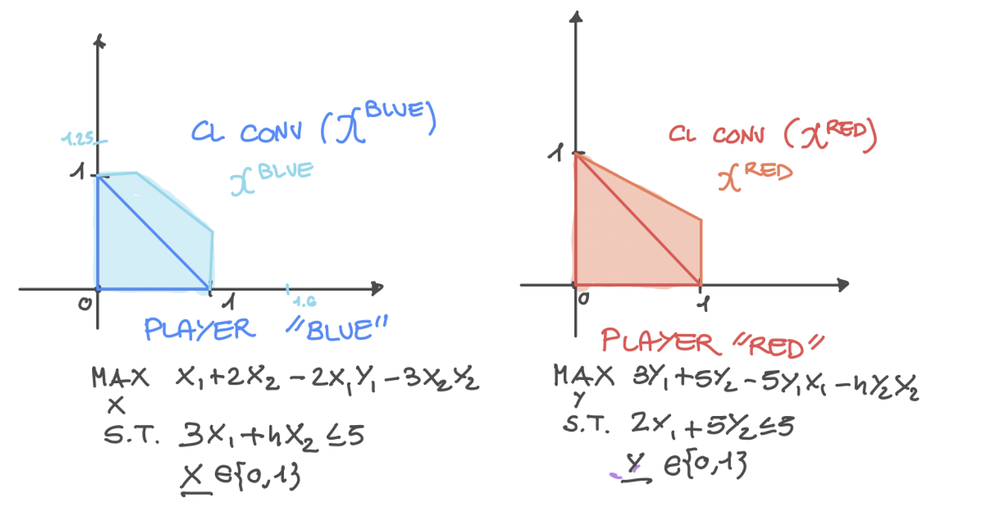

IPG
***************
An Integer Programming Game is a simultaneous game among  :math:`n` players solving a parameterized (mixed) Integer Program.
In ZERO, we support IPGs where each player :math:`i` solves the following problem:

.. math::

    \min_{x^i} (c^i) ^\top x^i + (x^{-i})^\top C^ix^i + d^T x^{-i} \\
    \text{s.t.} \quad A^ix^i\le b^i \\
    \quad \quad x^i \ge 0 \\
    \quad \quad  x^i_j \in \mathbb{N} \quad  \forall j \in \mathcal{I}^i

Where :math:`\mathcal{I}` is the set of indices of integer variables.
In other words, the objective function takes a specific bi-linear form.

====================================
A quick example
====================================

Consider the following Integer Programming Game: The first player is the **x** player, whose decision variables are :math:`x`. The second player is the **y** player where its variables are :math:`y`.

.. note::
    We slightly change the notation with respect to ZERO's arguments for the exposition of this game. For instance, here for :math:`x`, we point to the first player's variables instead of the parameters of a  :cpp:class:`IP_Param`. The example below should clarify any doubt.

The x player's optimization problem is as follows

.. math::

 \max_{x_1, x_2} x_1 + 2x_2 - 2x_1y_1 -3x_2y_2

 \text{s.t.} \quad   3x_1+4x_2 &\le 5

 \quad \quad  x_1, x_2 &\in \{0,1\}

While the y player's optimization problem is:

.. math::

 \max_{y_1, y_2} 3y_1 + 5y_2 - 5y_1x_1 -4y_2x_2

 \text{s.t.} \quad   2y_1+5y_2 &\le 5

 \quad \quad  y_1, y_2 &\in \{0,1\}

The problem has two pure Nash equilibria
:math:`(x_1, x_2, y_1, y_2) = (0, 1, 1, 0)`, and :math:`(x_1, x_2, y_1, y_2) = (1, 0, 0, 1)`, and a mixed Equilibrium :math:`(x_1, x_2, y_1, y_2) = (2/9, 7/9, 2/5, 3/5)`.

====================================
Modeling and solving the problem
====================================
The first step in modeling this Integer Programming Game is to include `zero.h` and create a derived class of :cpp:class:`Game::IPG`. The minimal constructor for :cpp:class:`Game::IPG` involves passing a pointer to `GRBEnv` (Check Gurobi's C++ `reference manual <https://www.gurobi.com/documentation/8.1/refman/cpp_api_overview.html>`_
). The derived class should indeed instantiate the base class (Game::IPG) using such a constructor. The code below gives an example.

.. code-block:: c

    #include <zero.h>

    int main(int argc, char **argv) {

      GRBEnv GurobiEnv;
      try {

         Models::IPG::IPGInstance IPG_Instance; // The IPG Instance
         int                      numItems = 2, numPlayers = 2;

         arma::vec      c(numItems), d(numItems * (numPlayers - 1));                              // Profits c in the objective
         arma::sp_mat   C(numItems * (numPlayers - 1), numItems); // C terms in the objective
         arma::sp_mat   a(1, numItems);                           // LHS for Knapsack constraint
         arma::vec      b(1);                                     // RHS for constraints
         arma::vec      IntegerIndexes(numItems);                 // The index of the integer variables
         VariableBounds VarBounds = {{0, 1}, {0, 1}};             // Implicit bounds on variables

         // Fill the values in the paramterized integer problem
         for (unsigned int i = 0; i < numItems; ++i)
            IntegerIndexes.at(i) = i;

         C(0, 0) = 2; // C terms in the objective
         C(1, 1) = 3;
         a(0, 0) = 3; // Knapsack Constraints
         a(0, 1) = 4;
         b(0)    = 5;  // Knapsack Capacity
         c(0)    = -1; // The standard is minimization, hence minus
         c(1)    = -2;
         d(0)    = 0;
         d(1)    = 0;

         // Create a parametrized Integer Program
         MathOpt::IP_Param PlayerOne(C, a, b, c, d, IntegerIndexes, VarBounds, &GurobiEnv);

         // Parametrized Integer Program for the second player.
         C(0, 0) = 5;
         C(1, 1) = 4;
         a(0, 0) = 2;
         a(0, 1) = 5;
         c(0)    = -3;
         c(1)    = -5;

         MathOpt::IP_Param PlayerTwo(C, a, b, c, d, IntegerIndexes, VarBounds, &GurobiEnv);

         // Add the players to the instance. We can also specify a file path to write the instance
         IPG_Instance.addIPParam(PlayerOne, "A_Parametrized_KnapsackProblem1");
         IPG_Instance.addIPParam(PlayerTwo, "A_Parametrized_KnapsackProblem2");
         IPG_Instance.save("A_Knapsack_Game"); // Save the instance with the standardize format
         Models::IPG::IPG KnapsackGame(&GurobiEnv, IPG_Instance); // Create a model from the instance
         // A few optional settings
         KnapsackGame.setNumThreads(4);            // How many threads, if supported by the solver?
         KnapsackGame.setTimeLimit(5);             // Time limit in second
         KnapsackGame.finalize();                  // Lock the model
         KnapsackGame.setDeviationTolerance(3e-4); // Numerical tolerance
         // Run and get the results

         // Cut and Play
         KnapsackGame.setAlgorithm(Data::IPG::Algorithms::CutAndPlay);
         KnapsackGame.setLCPAlgorithm(Data::LCP::Algorithms::MIP); // How do we solve the LCPs?
         KnapsackGame.findNashEq();
         std::cout << "The Cut-and-Play solution" << std::endl;
         KnapsackGame.getX().at(0).print("Player 1:"); // Print the solution
         KnapsackGame.getX().at(1).print("\n Player 2:");

         // Zero Regrets
         KnapsackGame.setAlgorithm(Data::IPG::Algorithms::ZERORegrets);
         KnapsackGame.setGameObjective(Data::IPG::Objectives::ZERORegrets_PlayerOne);
         KnapsackGame.findNashEq();
         std::cout << "The ZERO Regrets solution" << std::endl;
         KnapsackGame.getX().at(0).print("Player 1:"); // Print the solution
         KnapsackGame.getX().at(1).print("\n Player 2:");
      } catch (ZEROException &e) {
         throw ZEROException(e);
      }
    }

- With the method `setAlgorithm` of :cpp:class:`Game::IPG`, we set the algorithm to solve the Integer Programming Game. We can use either :cpp:class:`Algorithms::IPG::CutAndPlay` to compute a mixed Nash equilibrium or :cpp:class:`Algorithms::IPG::ZERORegrets` to compute the pure Nash equilibrium maximizing some function. In the latter case,
- The method `setLCPAlgorithm` specifies the algorithm used to solve the LCPs with the Cut-and-Play. It can be either :cpp:class:`Data::LCP::Algorithms::MIP`, :cpp:class:`Data::LCP::Algorithms::PATH`, or :cpp:class:`Data::LCP::Algorithms::MINLP`.
- The game's objective (not supported by PATH) forces an objective into the LCP (Cut-and-Play) or MIP (ZERORegrets) problem as to increase the chances of finding a good equilibrium given the objective. In case :cpp:class:`Algorithms::IPG::ZERORegrets` is selected, the algorithm will certify the optimality of the returned equilibrium.the  Values can be :cpp:class:`Data::IPG::Objectives::Quadratic` :cpp:class:`Data::IPG::Objectives::Linear` :cpp:class:`Data::IPG::Objectives::Feasibility`.
- Other options can be found in the documentation of :cpp:class:`Game::IPG`
